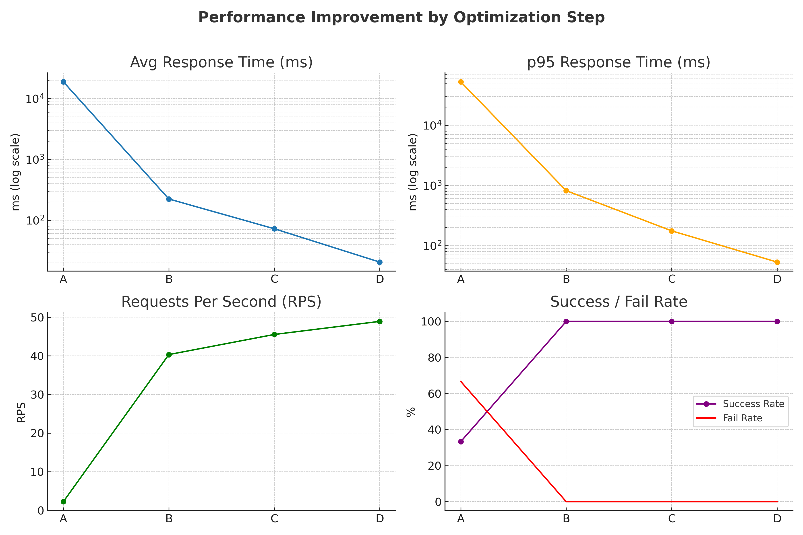

## 📊 성능 개선 요약

본 프로젝트에서는 대규모 상품 조회 API의 성능 개선을 위해 3단계 최적화를 진행하였습니다.
각 단계별 상세 보고서는 아래 링크에서 확인할 수 있습니다.
- [[index를 통한 성능개선] EXPLAIN 실험 결과](docs/performance/%5Bindex%EB%A5%BC%20%ED%86%B5%ED%95%9C%20%EC%84%B1%EB%8A%A5%EA%B0%9C%EC%84%A0%5D%20EXPLAIN%20%EC%8B%A4%ED%97%98%20%EA%B2%B0%EA%B3%BC.md)
- [[Index를 통한 성능 개선] K6 부하테스트 실험 결과](docs/performance/%5BIndex%EB%A5%BC%20%ED%86%B5%ED%95%9C%20%EC%84%B1%EB%8A%A5%20%EA%B0%9C%EC%84%A0%5D%20K6%20%EB%B6%80%ED%95%98%ED%85%8C%EC%8A%A4%ED%8A%B8%20%EC%8B%A4%ED%97%98%20%EA%B2%B0%EA%B3%BC.md)
- [[비정규화를 통한 성능개선] K6 부하테스트 실험 결과](docs/performance/%5B%EB%B9%84%EC%A0%95%EA%B7%9C%ED%99%94%EB%A5%BC%20%ED%86%B5%ED%95%9C%20%EC%84%B1%EB%8A%A5%EA%B0%9C%EC%84%A0%5D%20K6%20%EB%B6%80%ED%95%98%ED%85%8C%EC%8A%A4%ED%8A%B8%20%EC%8B%A4%ED%97%98%20%EA%B2%B0%EA%B3%BC.md)
- [[캐시를 통한 성능개선] k6 부하테스트 실험 결과](docs/performance/%5B%EC%BA%90%EC%8B%9C%EB%A5%BC%20%ED%86%B5%ED%95%9C%20%EC%84%B1%EB%8A%A5%EA%B0%9C%EC%84%A0%5D%20k6%20%EB%B6%80%ED%95%98%ED%85%8C%EC%8A%A4%ED%8A%B8.md)

---

### 📌 개선 단계

1. **그룹바이 기반 조회 (기존) → 인덱스 적용**
2. **그룹바이+인덱스 → 비정규화+인덱스**
3. **비정규화+인덱스 → 캐시 적용**

---

### 📈 통합 실험 결과

실험환경: 
- 상품 데이터 100만건, 상품 좋아요 데이터 700만건 
- 유저50명, 30초간 상품 목록 조회 API 호출

| 단계 | 평균 응답시간 | p95 응답시간 | RPS | 실패율 |
| --- | --- | --- | --- | --- |
| A. 그룹바이 | 18.83초 | 52.59초 | 2.23 | 66.7% |
| B. 그룹바이+인덱스 | 223.36 ms | 816.52 ms | 40.33 | 0% |
| C. 비정규화+인덱스 | 72.37 ms | 175.54 ms | 45.54 | 0% |
| D. 비정규화+인덱스+캐시 | 20.49 ms | 53.12 ms | 48.93 | 0% |

---

### 🚀 종합 효과 (A → D)

- **평균 응답시간**: 18.83초 → 20.49ms (**약 919배 단축**)
- **p95 응답시간**: 52.59초 → 53.12ms (**약 991배 단축**)
- **RPS**: 2.23 → 48.93 (**약 22배 증가**)
- **요청 성공률**: 33.3% → 100%

---

### 📍 결론

- **인덱스 적용**은 풀스캔과 불필요한 Filesort를 제거하여 기초 성능을 크게 향상시켰습니다.
- **비정규화**는 조인과 그룹바이 연산을 제거하여 평균 응답시간을 추가로 3배 이상 단축했습니다.
- **캐시 적용**은 반복 요청 처리 속도를 극대화하여 20ms 수준의 응답 속도를 달성하였고, 서버 부하를 최소화했습니다.
- 3단계 최적화를 통해 **대규모 트래픽 환경에서도 안정적이고 빠른 응답**이 가능해졌습니다.

