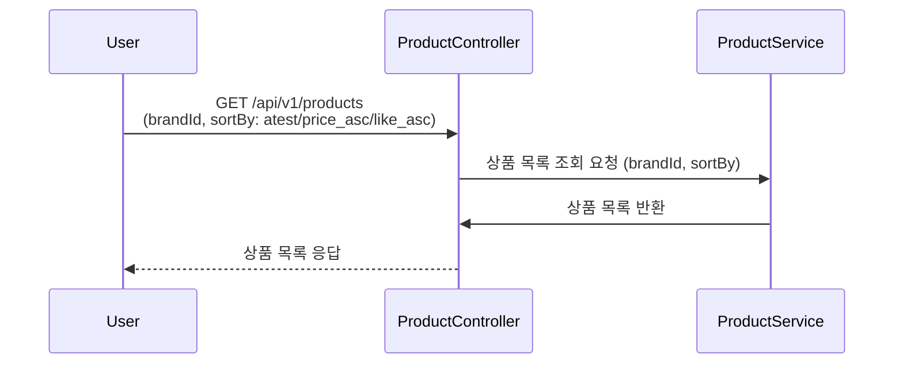
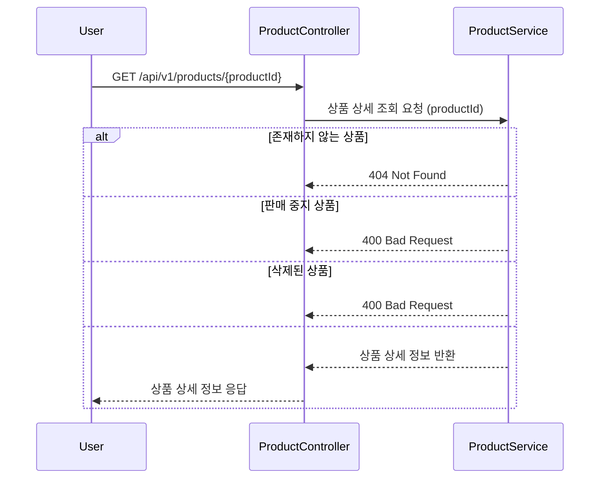
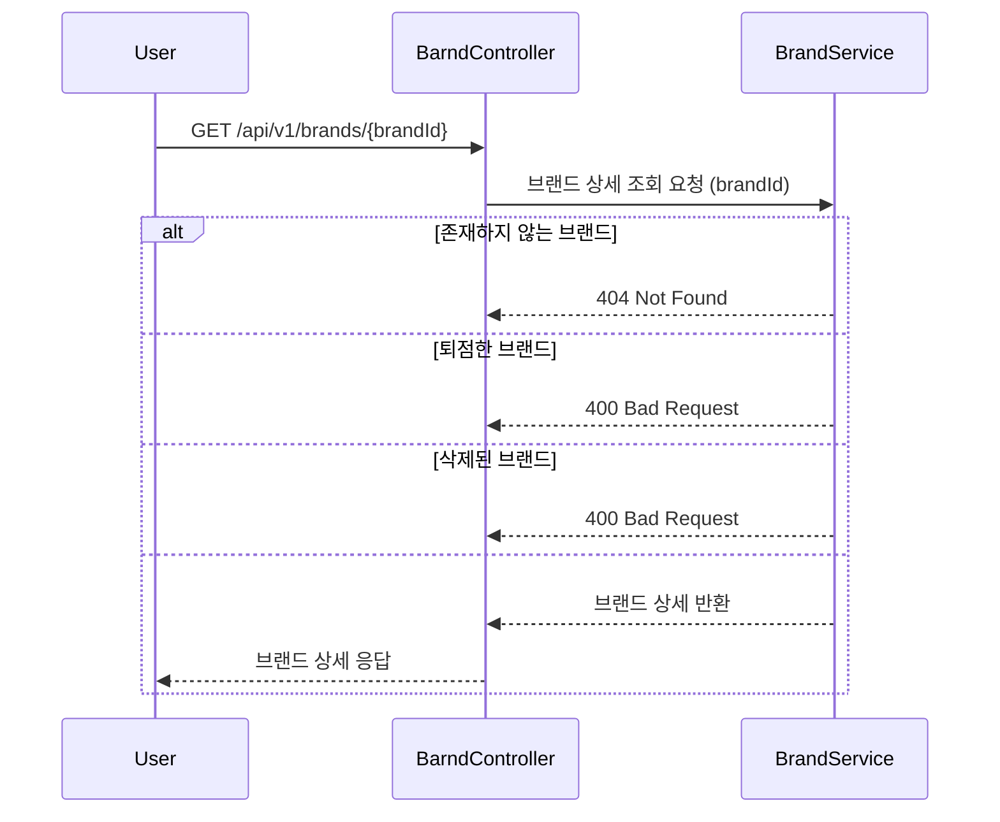
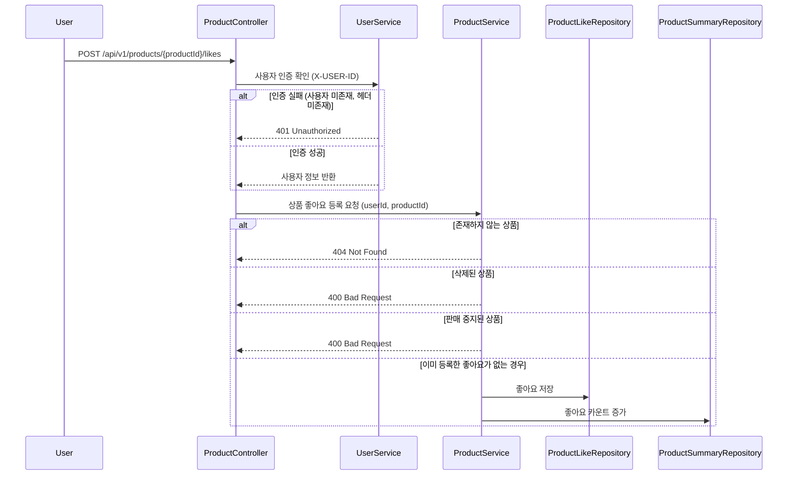
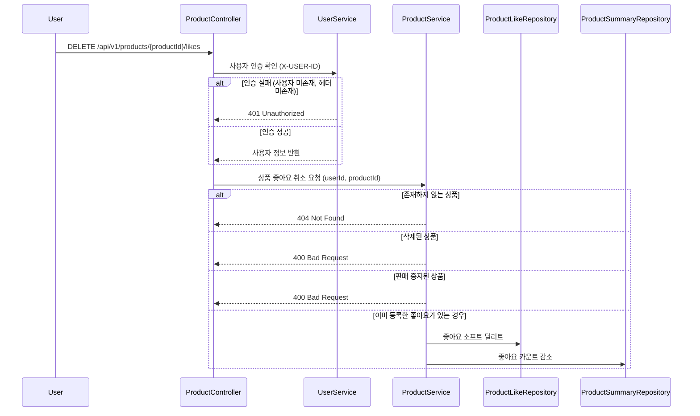
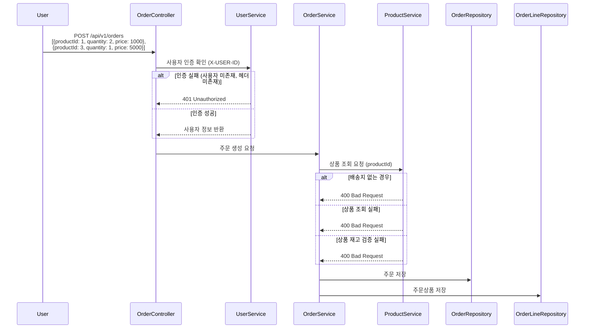
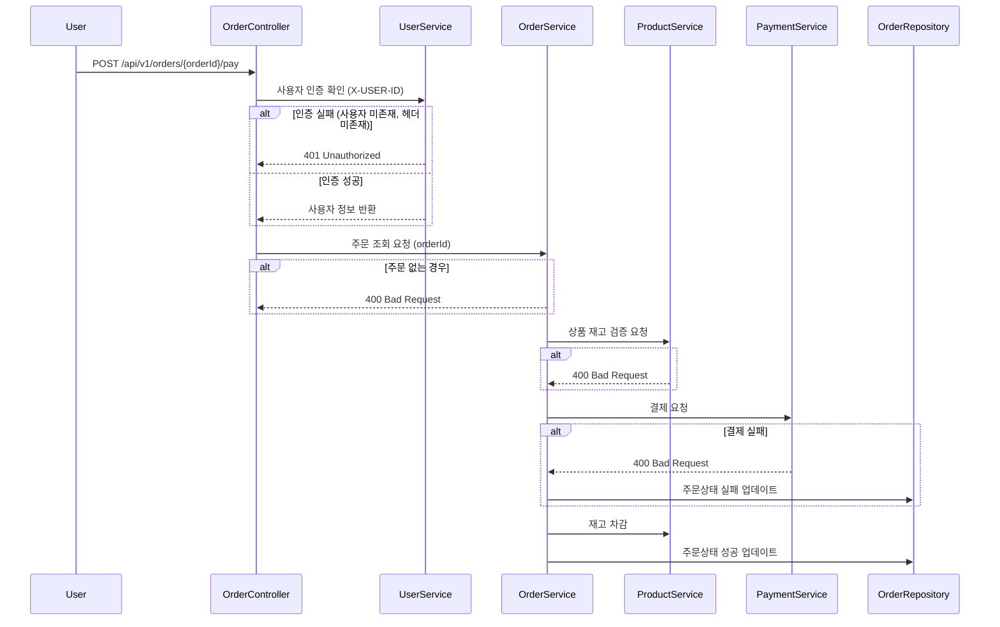

## 상품 목록 조회

```mermaid
sequenceDiagram
	participant U as User
	participant PC as ProductController
	participant PS as ProductService

	U->>PC: GET /api/v1/products<br/>(brandId, sortBy: atest/price_asc/like_asc)
	PC->>PS: 상품 목록 조회 요청 (brandId, sortBy)
	PS->>PC: 상품 목록 반환
	PC-->>U: 상품 목록 응답
	
	
	
```

## 상품 상세 조회

```mermaid
sequenceDiagram
	participant U as User
	participant PC as ProductController
	participant PS as ProductService

	U->>PC: GET /api/v1/products/{productId}
	PC->>PS: 상품 상세 조회 요청 (productId)
	alt 존재하지 않는 상품
		PS-->>PC: 404 Not Found
	else 판매 중지 상품
		PS-->>PC: 400 Bad Request
	else 삭제된 상품
		PS-->>PC: 400 Bad Request
	else
		PS-->>PC: 상품 상세 정보 반환
		PC-->>U: 상품 상세 정보 응답
end	
	
	
```

## 브랜드 조회

```mermaid
sequenceDiagram
	participant U as User
	participant BC as BarndController
	participant BS as BrandService

	U->>BC: GET /api/v1/brands/{brandId}
	BC->>BS: 브랜드 상세 조회 요청 (brandId)
	alt 존재하지 않는 브랜드
		BS-->>BC: 404 Not Found
	else 퇴점한 브랜드
		BS-->>BC: 400 Bad Request
	else 삭제된 브랜드
		BS-->>BC: 400 Bad Request
	else
		BS-->>BC: 브랜드 상세 반환
		BC-->>U: 브랜드 상세 응답
end
```

## 상품 좋아요 등록

```mermaid
sequenceDiagram
	participant U as User
	participant PC as ProductController
	participant US as UserService
	participant PS as ProductService
	
	participant PLR as ProductLikeRepository
	participant PSR as ProductSummaryRepository

	U->>PC: POST /api/v1/products/{productId}/likes
	
	PC->>US: 사용자 인증 확인 (X-USER-ID)
	alt 인증 실패 (사용자 미존재, 헤더 미존재)
		US-->>PC: 401 Unauthorized
	else 인증 성공
		US-->>PC: 사용자 정보 반환
	end
	
	PC->>PS: 상품 좋아요 등록 요청 (userId, productId)
	alt 존재하지 않는 상품
		PS-->>PC: 404 Not Found
	else 삭제된 상품
		PS-->>PC: 400 Bad Request
	else 판매 중지된 상품
		PS-->>PC: 400 Bad Request
	else 이미 등록한 좋아요가 없는 경우
		PS->>PLR: 좋아요 저장
		PS->>PSR: 좋아요 카운트 증가
	end
```

## 상품 좋아요 취소

```mermaid
sequenceDiagram
	participant U as User
	participant PC as ProductController
	participant US as UserService
	participant PS as ProductService
	
	participant PLR as ProductLikeRepository
	participant PSR as ProductSummaryRepository

	U->>PC: DELETE /api/v1/products/{productId}/likes
	
	PC->>US: 사용자 인증 확인 (X-USER-ID)
	alt 인증 실패 (사용자 미존재, 헤더 미존재)
		US-->>PC: 401 Unauthorized
	else 인증 성공
		US-->>PC: 사용자 정보 반환
	end
	
	PC->>PS: 상품 좋아요 취소 요청 (userId, productId)
	alt 존재하지 않는 상품
		PS-->>PC: 404 Not Found
	else 삭제된 상품
		PS-->>PC: 400 Bad Request
	else 판매 중지된 상품
		PS-->>PC: 400 Bad Request
	else 이미 등록한 좋아요가 있는 경우		
		PS->>PLR: 좋아요 소프트 딜리트
		PS->>PSR: 좋아요 카운트 감소
	end

```

## 주문 생성

```mermaid
sequenceDiagram
	participant U as User
	participant OC as OrderController
	participant US as UserService
	participant OS as OrderService
	participant PS as ProductService
	
	participant OR as OrderRepository
	participant OLR as OrderLineRepository

	U->>OC: POST /api/v1/orders<br/>[{productId: 1, quantity: 2, price: 1000},<br/> {productId: 3, quantity: 1, price: 5000}]

	OC->>US: 사용자 인증 확인 (X-USER-ID)
	alt 인증 실패 (사용자 미존재, 헤더 미존재)
		US-->>OC: 401 Unauthorized
	else 인증 성공
		US-->>OC: 사용자 정보 반환
	end

	OC->>OS: 주문 생성 요청
	OS->>PS: 상품 조회 요청 (productId)
	alt 배송지 없는 경우
		PS-->>OS: 400 Bad Request
	else 상품 조회 실패
		PS-->>OS: 400 Bad Request
	else 상품 재고 검증 실패
		PS-->>OS: 400 Bad Request
	end
	
	OS->>OR: 주문 저장
	OS->>OLR: 주문상품 저장
	
	
```

## 결제 처리

```mermaid
sequenceDiagram
	participant U as User
	participant OC as OrderController
	participant US as UserService
	participant OS as OrderService
	participant PS as ProductService
	participant PAYS as PaymentService
	
	participant OR as OrderRepository
	
	U->>OC: POST /api/v1/orders/{orderId}/pay

	OC->>US: 사용자 인증 확인 (X-USER-ID)
	alt 인증 실패 (사용자 미존재, 헤더 미존재)
		US-->>OC: 401 Unauthorized
	else 인증 성공
		US-->>OC: 사용자 정보 반환
	end
	
	OC->>OS: 주문 조회 요청 (orderId)
	alt 주문 없는 경우
		OS-->>OC: 400 Bad Request
	end
	
	OS->>PS: 상품 재고 검증 요청
	alt
		PS-->>OS: 400 Bad Request
	end
	
	OS->>PAYS: 결제 요청 
	alt 결제 실패 
		PAYS-->>OS: 400 Bad Request
		OS->>OR: 주문상태 실패 업데이트	
	end
	
	OS->>PS: 재고 차감
	OS->>OR: 주문상태 성공 업데이트	

```