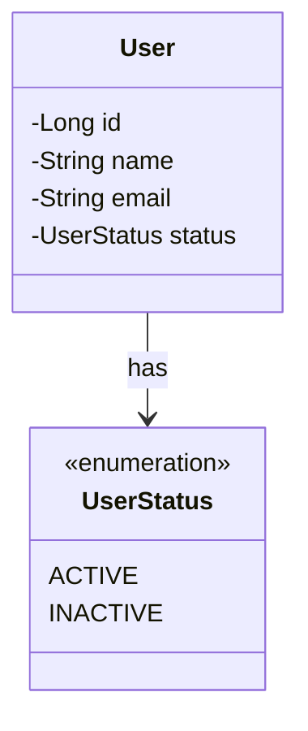
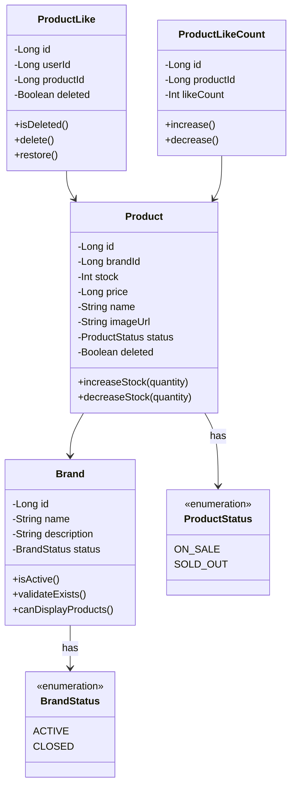
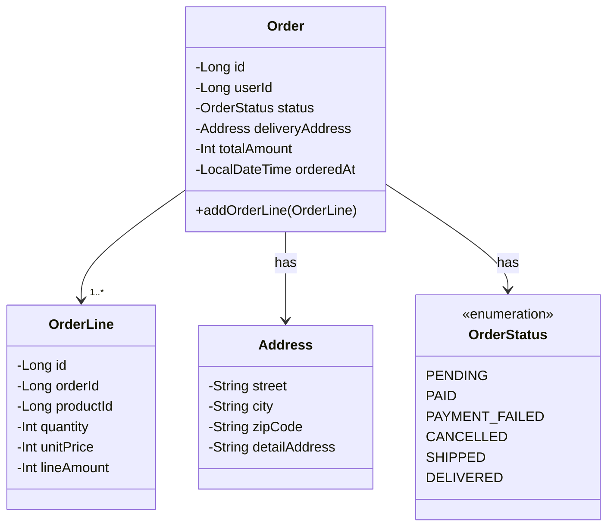
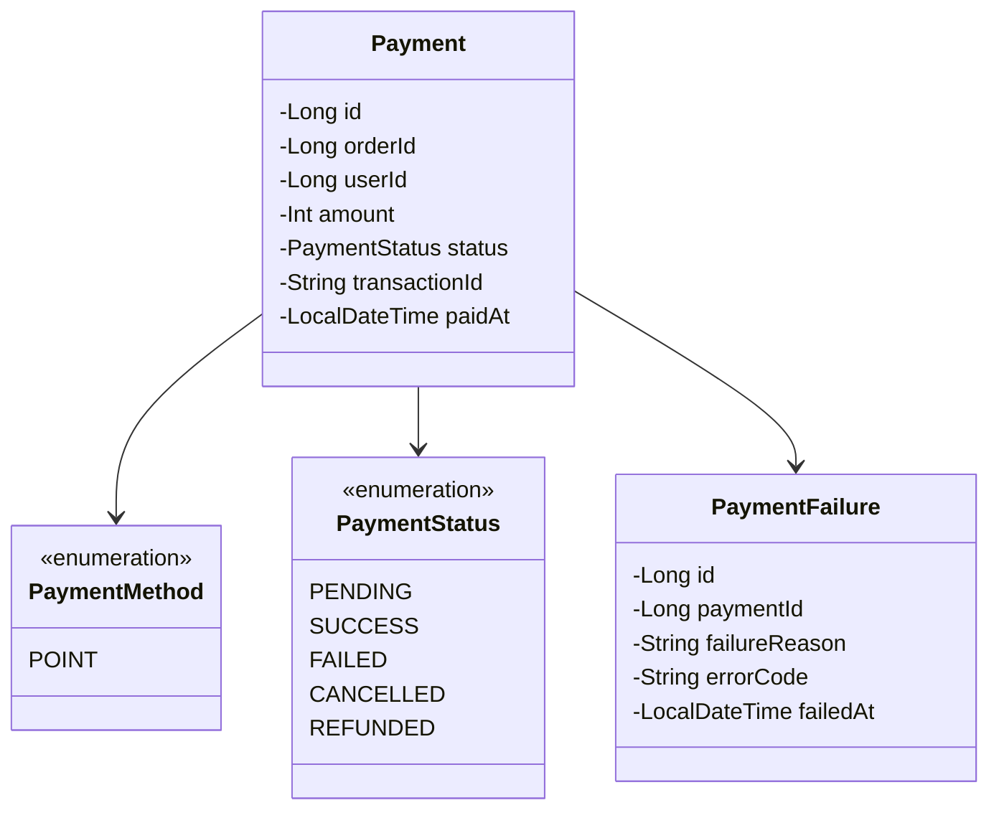
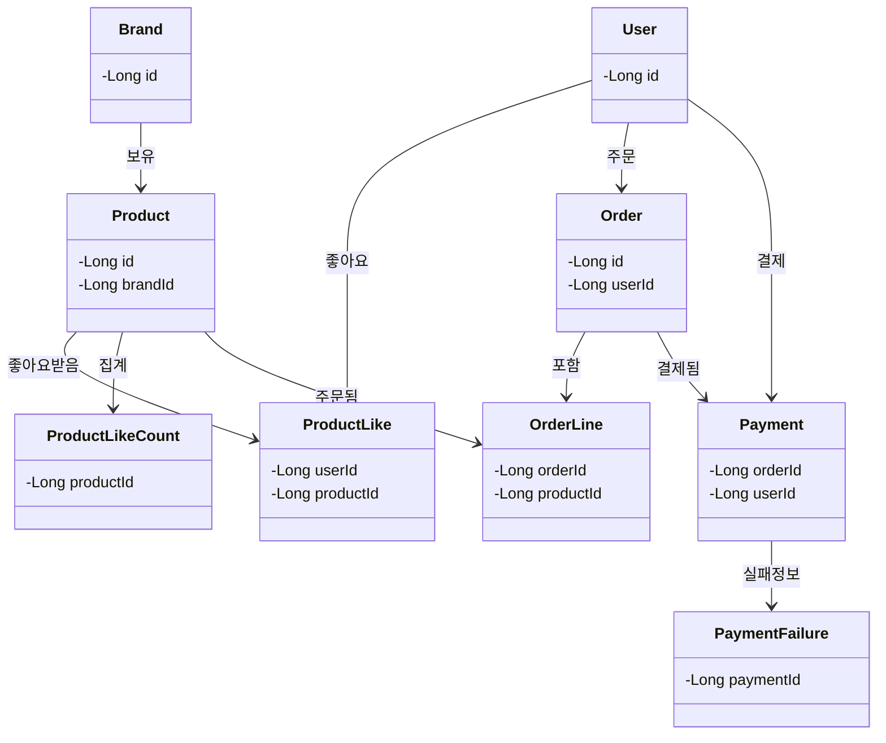

## 유저 도메인

```mermaid
classDiagram
    class User {
        -Long id
        -String name
        -String email
        -UserStatus status
    }
    
    class UserStatus {
        <<enumeration>>
        ACTIVE
        INACTIVE
    }
    
    User --> UserStatus : has 
```

# 상품 도메인

```mermaid
classDiagram
    %% 브랜드
    class Brand {
        -Long id
        -String name
        -String description
        -BrandStatus status
        +isActive()
        +validateExists()
        +canDisplayProducts()
    }
    
    class BrandStatus {
        <<enumeration>>
        ACTIVE
        CLOSED
    }
    
    %% 상품
    class Product {
        -Long id
        -Long brandId
        -Int stock
        -Long price
        -String name
        -String imageUrl
        -ProductStatus status
	      -Boolean deleted
	      +increaseStock(quantity)
	      +decreaseStock(quantity)
    }
   
    
    class ProductStatus {
        <<enumeration>>
        ON_SALE
        SOLD_OUT
    }
    
    class ProductLike {
        -Long id
        -Long userId
        -Long productId
        -Boolean deleted
        +isDeleted()
        +delete()
        +restore()
    }
    
    %% 상품 좋아요 카운트 (집계)
    class ProductLikeCount {
	      -Long id
        -Long productId
        -Int likeCount
        +increase()
        +decrease()
    }
    
    %% 관계
    Product --> Brand
    Product --> ProductStatus : has
    Brand --> BrandStatus : has
    
    ProductLike --> Product
    ProductLikeCount --> Product
```

## 주문 도메인

```mermaid
classDiagram
    %% 주문
    class Order {
        -Long id
        -Long userId
        -OrderStatus status
        -Address deliveryAddress
        -Int totalAmount
        -LocalDateTime orderedAt
        +addOrderLine(OrderLine)
    }
    
    %% 주문 상품
    class OrderLine {
        -Long id
        -Long orderId
        -Long productId
        -Int quantity
        -Int unitPrice
        -Int lineAmount
    }
    
    %% 값 객체들
    class Address {
        -String street
        -String city
        -String zipCode
        -String detailAddress
    }
    
    class OrderStatus {
        <<enumeration>>
        PENDING
        PAID
        PAYMENT_FAILED
        CANCELLED
        SHIPPED
        DELIVERED
    }
    
    %% 관계
    Order --> "1..*" OrderLine
    Order --> Address : has
    Order --> OrderStatus : has
```

## 결제 도메인

```mermaid
classDiagram
    class Payment {
        -Long id
        -Long orderId
        -Long userId
        -Int amount
        -PaymentStatus status
        -String transactionId
        -LocalDateTime paidAt    }
    
    class PaymentMethod {
        <<enumeration>>
        POINT
    }
    
    class PaymentStatus {
        <<enumeration>>
        PENDING
        SUCCESS
        FAILED
        CANCELLED
        REFUNDED
    }
    
    %% 결제 실패 정보
    class PaymentFailure {
		    -Long id
        -Long paymentId
        -String failureReason
        -String errorCode
        -LocalDateTime failedAt
    }
    
    %% 관계
    Payment --> PaymentMethod
    Payment --> PaymentStatus
    Payment --> PaymentFailure
```

## 도메인간 연관관계

```mermaid
classDiagram
    %% 도메인별 대표 클래스
    class User {
        -Long id
    }
    
    class Product {
        -Long id
        -Long brandId
    }
    
    class Brand {
        -Long id
    }
    
    class ProductLike {
        -Long userId
        -Long productId
    }
    
    class ProductLikeCount {
        -Long productId
    }
    
    class Order {
        -Long id
        -Long userId
    }
    
    class OrderLine {
        -Long orderId
        -Long productId
    }
    
    class Payment {
        -Long orderId
        -Long userId
    }
    
    class PaymentFailure {
        -Long paymentId
    }
    
    %% 도메인 간 연관관계
    User --> ProductLike : 좋아요
    Product --> ProductLike : 좋아요받음
    Product --> ProductLikeCount : 집계
    
    User --> Order : 주문
    Order --> OrderLine : 포함
    Product --> OrderLine : 주문됨
    
    User --> Payment : 결제
    Order --> Payment : 결제됨
    Payment --> PaymentFailure : 실패정보
    
    Brand --> Product : 보유
```