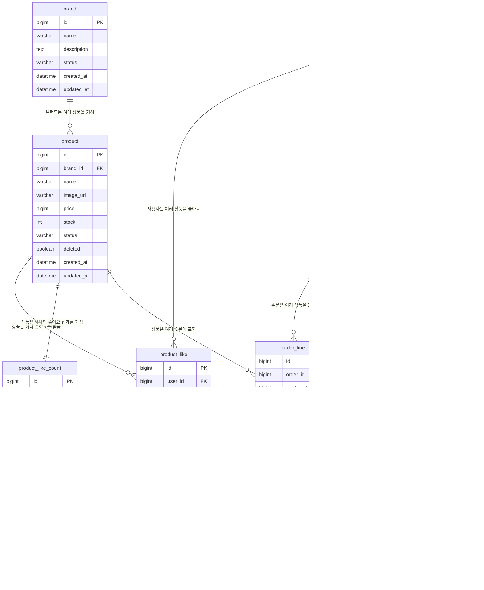

```mermaid
erDiagram
    %% 사용자 테이블
    users {
        bigint id PK
        varchar name
        varchar email
        varchar status
        datetime created_at
        datetime updated_at
    }
    
    %% 브랜드 테이블
    brand {
        bigint id PK
        varchar name
        text description
        varchar status
        datetime created_at
        datetime updated_at
    }
    
    %% 상품 테이블
    product {
        bigint id PK
        bigint brand_id FK
        varchar name
        varchar image_url
        bigint price
        int stock
        varchar status
        boolean deleted
        datetime created_at
        datetime updated_at
    }
    
    %% 상품 좋아요 테이블
    product_like {
        bigint id PK
        bigint user_id FK
        bigint product_id FK
        boolean deleted
        datetime created_at
        datetime updated_at
    }
    
    %% 상품 좋아요 카운트 테이블 (집계)
    product_like_count {
        bigint id PK
        bigint product_id FK
        int like_count
        datetime updated_at
    }
    
    %% 주문 테이블
    orders {
        bigint id PK
        bigint user_id FK
        varchar status
        varchar street
        varchar city
        varchar zip_code
        varchar detail_address
        int total_amount
        datetime ordered_at
        datetime created_at
        datetime updated_at
    }
    
    %% 주문 상품 테이블
    order_line {
        bigint id PK
        bigint order_id FK
        bigint product_id FK
        int quantity
        int unit_price
        int line_amount
        datetime created_at
    }
    
    %% 결제 테이블
    payment {
        bigint id PK
        bigint order_id FK
        bigint user_id FK
        int amount
        varchar payment_method
        varchar status
        varchar transaction_id
        datetime paid_at
        datetime created_at
        datetime updated_at
    }
    
    %% 결제 실패 테이블
    payment_failure {
        bigint id PK
        bigint payment_id FK
        varchar failure_reason
        varchar error_code
        datetime failed_at
    }
    
    %% 관계 정의
    brand ||--o{ product : "브랜드는 여러 상품을 가짐"
    
    users ||--o{ product_like : "사용자는 여러 상품을 좋아요"
    product ||--o{ product_like : "상품은 여러 좋아요를 받음"
    product ||--|| product_like_count : "상품은 하나의 좋아요 집계를 가짐"
    
    users ||--o{ orders : "사용자는 여러 주문을 생성"
    orders ||--o{ order_line : "주문은 여러 상품을 포함"
    product ||--o{ order_line : "상품은 여러 주문에 포함"
    
    users ||--o{ payment : "사용자는 여러 결제를 진행"
    orders ||--o{ payment : "주문은 여러 결제를 가질 수 있음"
    payment ||--o| payment_failure : "결제는 실패 정보를 가질 수 있음"
```