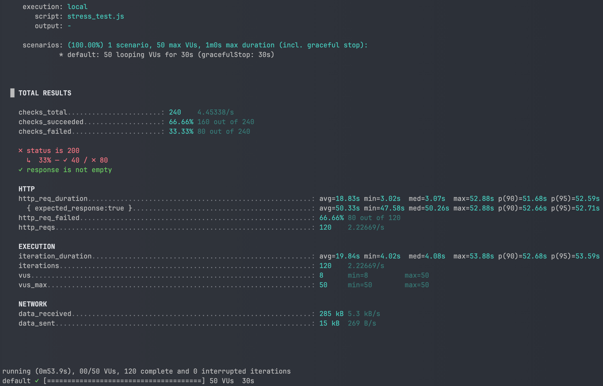
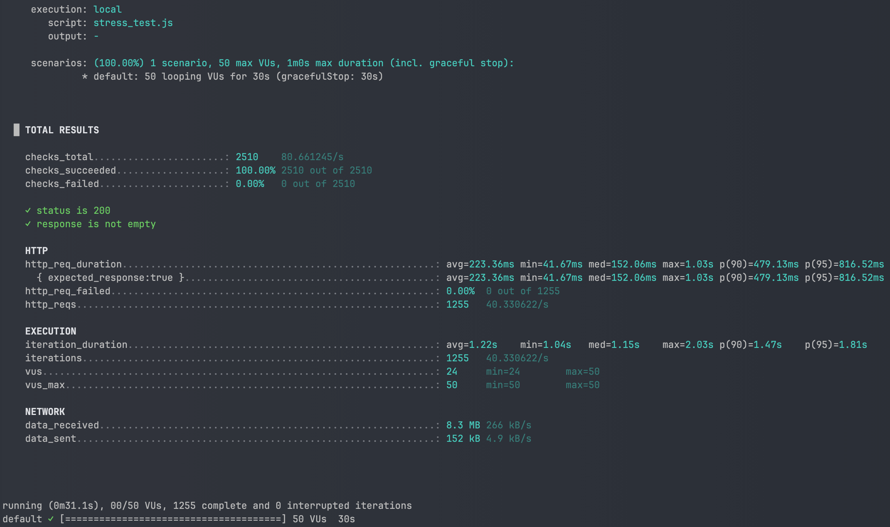

## 📌 인덱스 적용 전후 성능 비교 보고서

### 1. 실험 목적

`product`와 `product_like` 테이블을 조인하여 특정 브랜드의 상품 목록을 좋아요 수, 가격, 최신순 등으로 조회하는 쿼리에 대해

**인덱스 적용 전후의 성능 차이**를 측정하고, 인덱스가 실제 서비스 성능에 미치는 영향을 검증한다.

---

### 2. 실험 환경

- **DB**: MySQL 8.0 (Docker, utf8mb4)
- OS: MacOS M2Air RAM 16GB
- **데이터 규모**:
    - 브랜드: 200개
    - 상품: 1,000,000개
    - 상품 좋아요: 7,000,000개
- **테스트 쿼리 엔드포인트**:
    - `GET /api/v1/products/stress?brandId=55&sortBy=likes_desc`
- **부하 테스트 도구**: k6
- **테스트 조건**:
    - Virtual Users(VUs): 50
    - 지속 시간: 30초
    - 시나리오: 모든 VU가 동시에 요청 반복

---

### 3. 인덱스 구성

```sql
-- 인덱스 적용 전: 기본 PK만 존재
-- 인덱스 적용 후:
CREATE INDEX idx_product_brand_price_id
    ON product (brand_id, price, id);

CREATE INDEX idx_product_like_product_id_status
    ON product_like (product_id, status);
```

---

### 4. 테스트 쿼리

```sql
SELECT p.id, p.brand_id, p.name, p.price, COUNT(pl.id) AS like_cnt
FROM product p
LEFT JOIN product_like pl
    ON pl.product_id = p.id AND pl.status = 'ACTIVE'
WHERE p.brand_id = 55
GROUP BY p.id
ORDER BY like_cnt DESC, p.id DESC
LIMIT 20 OFFSET 0;
```

---

### 5. 실험 절차

1. 인덱스 제거 후 부하 테스트 실행 → 성능 측정
2. 인덱스 생성
3. 동일 조건으로 부하 테스트 재실행 → 성능 측정
4. 결과 비교

---

### 6. 실험 결과

| **항목** | **인덱스 없음** | **인덱스 있음** | **개선 배수/변화량** |
| --- | --- | --- | --- |
| 평균 응답 시간 (`avg http_req_duration`) | 18.83초 | 0.223초 | **약 84.3배 단축** |
| p95 응답 시간 | 52.59초 | 0.817초 | **약 64.4배 단축** |
| 요청 성공률 | 33.3% | 100% | **+66.7%p** |
| 초당 요청 수 (RPS) | 2.23 | 40.33 | **약 18.1배 증가** |
| 오류율 (http_req_failed) | 66.7% | 0% | **–66.7%p** |

---

### 7. k6 실행 로그

**인덱스 없음**



**인덱스 있음**



---

### 7. 분석

- 인덱스가 없을 경우, **풀스캔 + 임시 테이블 생성 + Filesort**로 인해 응답 시간이 수 초 이상 소요되며, 부하 상황에서 절반 가까이 요청 실패.
- **RPS는 약 18배 증가**, 서비스 처리량이 대폭 향상됨.

---

### 8. 결론

- 인덱스 설계는 대규모 데이터에서 **성능·안정성에 결정적인 영향을 미친다**.

---