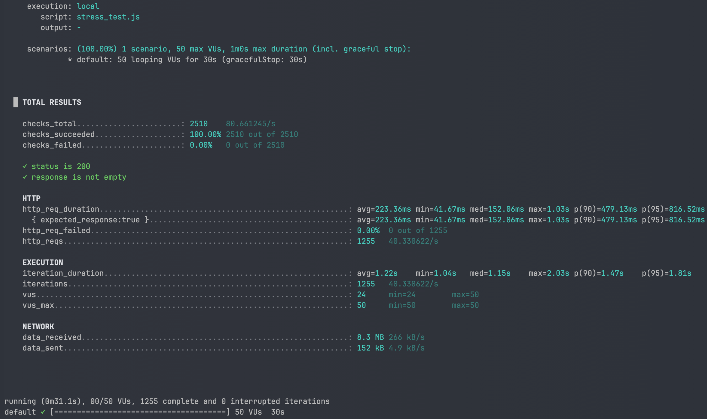
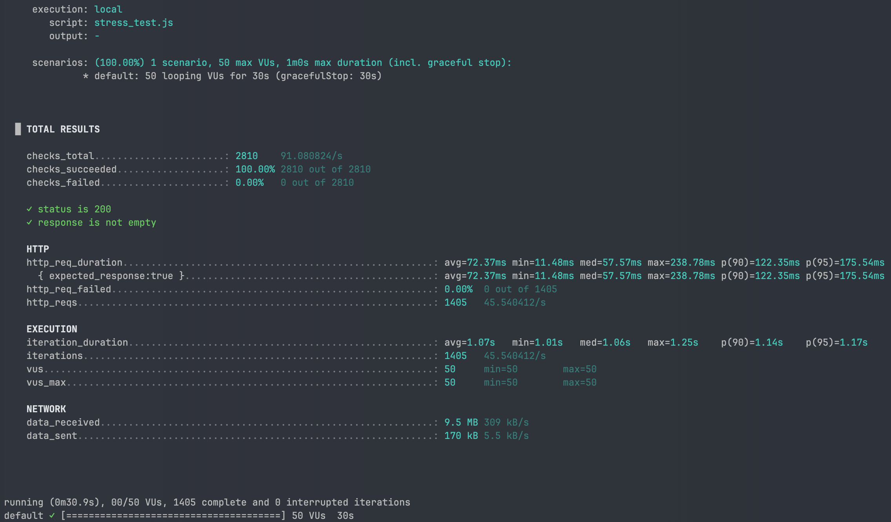

## 📌 비정규화 전후 성능 비교 보고서

### 1. 실험 목적

`product`와 `product_like` 테이블을 조인하여 특정 브랜드 상품 목록을 좋아요 수, 가격, 최신순 등으로 조회하는 기능에서

**기존 GROUP BY 기반 집계 방식**과 **비정규화(상품 테이블에 like_count 컬럼 추가) 방식**의 성능 차이를 측정한다.

---

### 2. 실험 환경

- **DB**: MySQL 8.0 (Docker, utf8mb4)
- **OS**: MacOS M2Air RAM 16GB
- **데이터 규모**:
    - 브랜드: 200개
    - 상품: 1,000,000개
    - 상품 좋아요: 7,000,000개
- **테스트 쿼리 엔드포인트**:
    - `GET /api/v1/products/stress?brandId=55&sortBy=likes_desc`
- **부하 테스트 도구**: k6
- **테스트 조건**:
    - Virtual Users(VUs): 50
    - 지속 시간: 30초
    - 시나리오: 모든 VU가 동시에 요청 반복

---

### 3. 인덱스 구성

### AS-IS (GROUP BY + 인덱스)

```sql
CREATE INDEX idx_product_brand_price_id
    ON product (brand_id, price, id);

CREATE INDEX idx_product_like_status_product
    ON product_like (status, product_id);
```

### TO-BE (비정규화 + 인덱스)

```sql
CREATE INDEX idx_product_brand_like_id
    ON product (brand_id, like_count, id);
```

---

### 4. 테스트 쿼리

### AS-IS: GROUP BY 집계

```sql
SELECT p.id, p.brand_id, p.name, p.price, COUNT(pl.id) AS like_cnt
FROM product p
LEFT JOIN product_like pl
    ON pl.product_id = p.id AND pl.status = 'ACTIVE'
WHERE p.brand_id = 55
GROUP BY p.id
ORDER BY like_cnt DESC, p.id DESC
LIMIT 20 OFFSET 0;
```

### TO-BE: 비정규화 컬럼 직접 사용

```sql
SELECT p.id, p.brand_id, p.name, p.price, p.like_count
FROM product p
WHERE p.brand_id = 55
ORDER BY p.like_count DESC, p.id DESC
LIMIT 20 OFFSET 0;
```

---

### 5. 실험 절차

1. **AS-IS 구조**(GROUP BY + 조인)에서 인덱스 적용 후 부하 테스트 → 성능 기록
2. **TO-BE 구조**(비정규화 + 인덱스)로 스키마 변경 후 동일 조건 부하 테스트

---

### 6. 실험 결과

| **항목** | **그룹바이+인덱스** | **비정규화+인덱스** | **개선 배수/변화량** |
| --- | --- | --- | --- |
| 평균 응답 시간 (`avg http_req_duration`) | 223.36 ms | 72.37 ms | **약 3.09배 단축** (–67.6%) |
| p95 응답 시간 | 816.52 ms | 175.54 ms | **약 4.65배 단축** (–78.5%) |
| 초당 요청 수 (RPS) | 40.33 | 45.54 | **약 12.9% 증가** (×1.129) |
| 실패율 (http_req_failed) | 0% | 0% | 변동 없음 |

---

### 7. k6 실행 로그

**GROUP BY + 조인 + 인덱스**



**비정규화 + 인덱스**



### 7. 분석

- **쿼리 구조 변경 효과**
    - LIKE_COUNT DESC + PK(ID) 조합 인덱스로 **정렬 비용이 사라짐**
- **처리 속도**
    - 평균 응답 시간은 **약 3배 개선**
    - p95 기준 응답 속도 4**배 개선**
- **부가적 장점**
    - CPU 부하 감소로 인해 동일 서버에서 더 많은 트래픽 처리 가능
    - 복잡한 임시 테이블 생성 제거

---

### 8. 결론

- 조인/집계 기반 조회의 병목이 명확하다면, 비정규화를 적극 검토할 가치가 있음