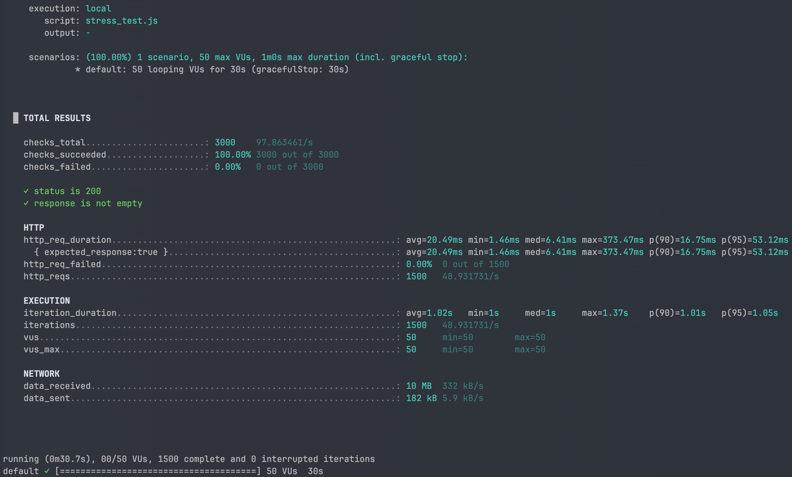

## **📌 캐시를 통한 성능 개선 보고서 (k6 부하 테스트)**

### **1. 실험 목적**

비정규화된 상품 테이블(product.like_count)에 인덱스를 적용한 상태에서,

**캐시 적용 전후**의 API 응답 성능을 측정하고, 캐시가 서비스 처리량과 응답 지연 시간에 미치는 영향을 검증한다.

---

### **2. 실험 환경**

- **DB**: MySQL 8.0 (Docker, utf8mb4)
- **OS**: MacOS M2 Air RAM 16GB
- **데이터 규모**:
    - 브랜드: 200개
    - 상품: 1,000,000개
    - 상품 좋아요: 7,000,000개
- **API 엔드포인트**:
    - GET /api/v1/products/stress?brandId=55&sortBy=likes_desc
- **부하 테스트 도구**: k6
- **테스트 조건**:
    - Virtual Users(VUs): 50
    - 지속 시간: 30초
    - 시나리오: 모든 VU가 동시에 요청 반복
- **캐시 조건**:
    - TTL: 2분
    - Key: 브랜드ID + 정렬조건 + 페이지정보

**3. 인덱스 구성**

```sql
-- 비정규화 + 인덱스
CREATE INDEX idx_product_brand_like_id
    ON product (brand_id, like_count, id);
```

### **4. 테스트 쿼리**

**DB 조회 (캐시 미적용)**

```sql
SELECT p.id, p.brand_id, p.name, p.price, p.like_count
FROM product p
WHERE p.brand_id = 55
ORDER BY p.like_count DESC, p.id DESC
LIMIT 20 OFFSET 0;
```

**캐시 적용**

- 첫 요청 시 DB 조회 후 캐시에 저장 (Cache-aside 전략)
- 이후 동일 조건 요청은 캐시에서 반환

### **5. 실험 절차**

1. **비정규화+인덱스** 상태에서 부하 테스트 → 성능 측정
2. 동일 환경에서 **캐시 로직 적용** 후 부하 테스트 → 성능 측정
3. 결과 비교

### 6. 실험 결과

| **항목** | **비정규화+인덱스** | **비정규화+인덱스+캐시** | **개선 배수/변화량** |
| --- | --- | --- | --- |
| 평균 응답 시간 (`avg http_req_duration`) | 72.37 ms | 20.49 ms | **약 3.53배 단축** (–71.7%) |
| p95 응답 시간 | 175.54 ms | 53.12 ms | **약 3.30배 단축** (–69.7%) |
| 초당 요청 수 (RPS) | 45.54 | 48.93 | **약 7.4% 증가** (×1.074) |
| 실패율 (http_req_failed) | 0% | 0% | 변동 없음 |

### **7. k6 실행 로그**

**비정규화+인덱스**


**비정규화+인덱스+캐시**



### **8. 분석**

- **평균 응답 시간**이 약 3.5배 단축되며, 대부분의 요청이 20ms대에서 처리됨
- p95 응답 시간도 3.3배 개선되어 **최악의 경우에도 53ms 수준**으로 안정적
- 캐시 적중률이 높을수록 DB 접근 횟수가 줄어들어 대규모 트래픽 대응 가능

---

### **9. 결론**

- 캐시 적용은 대규모 트래픽 환경에서 **응답 지연을 극적으로 줄이고**

  서버 자원을 효율적으로 사용하게 하여 **처리량과 안정성을 동시에 향상**시킨다.

- TTL 설정, Key 설계, 캐시 무효화 전략을 적절히 구성하면

  서비스 전반의 성능과 사용자 경험이 크게 개선된다.